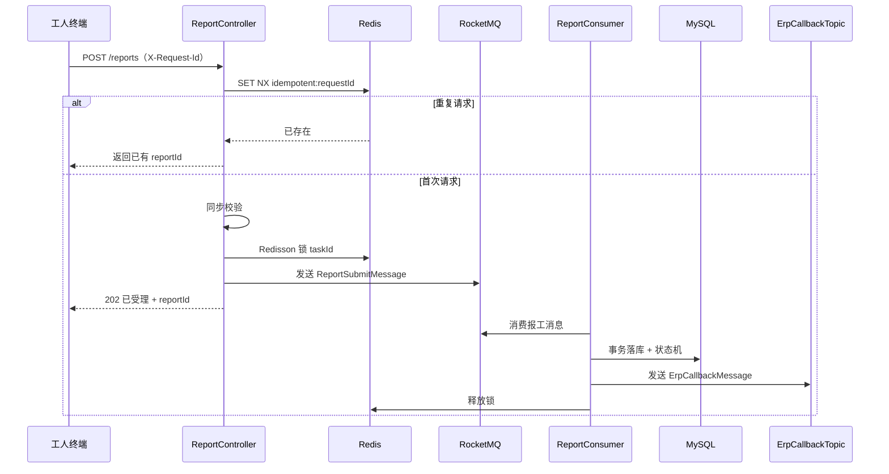

# MES 面试项目 · 40 天开发计划

> 原则：**核心后端业务手写**，**管理端/看板 UI 交给 AI**，范围严格对齐 [MES-设计摘要.md](./MES-设计摘要.md) 的 Phase 1 MVP。

---

## 0. 当前进度（截至 D5 进行中）

| 项 | 状态 | 说明 |
|----|------|------|
| Spring Boot 4.1 工程 | ✅ 已完成 | `com.fzy.mes.MesApplication` |
| pom 依赖 | ✅ 已完成 | MP / Redis / Redisson / RocketMQ / JWT / AspectJ / Actuator |
| `mes_db.sql` | ✅ 已完成 | 含表结构 + 基础种子数据 |
| `application.yml` | ✅ 已完成 | 直连 MySQL/Redis；**不含** `mes.jwt` / `mes.security`（JWT 在代码里配） |
| Entity + Mapper（13 实体 / 14 Mapper） | ✅ 已完成 | D2，`@MapperScan` + 单测查库通过 |
| 实体 Jakarta Validation | ✅ 已完成 | D2 `Create`/`Update` 分组；**新 API 校验迁 DTO** |
| 统一响应 `Result<T>` | 🟡 进行中 | 已有基础结构；Filter 鉴权失败仍非 `Result` JSON |
| 全局异常 + `@Valid` | 🟡 进行中 | 含登录校验、认证异常 |
| CORS 配置 | ❌ 未开始 | D3 剩余 |
| Redis / RocketMQ 骨架 | ❌ 未开始 | D4 |
| JWT 登录 | 🟡 进行中 | D5 提前启动：`SecurityConfig`（`common/config`）、Filter、`AuthService`、登录 API 已通 |
| 业务核心（状态机/报工/MQ） | ❌ 未开始 | D6+ |
| Vue 前端 | ❌ 未开始 | D7 |

**当前阶段**：D3 收尾（CORS）+ D4 中间件 + D5 JWT 收尾（RBAC、Redis 缓存、双令牌可选）并行。

**计划调整**：D1~D2 已完成；D5 JWT 主链路已提前打通，剩余 RBAC/缓存/响应格式统一按优化计划推进。

---

## 1. 项目定位（面试怎么说）

### 1.1 你要证明什么

面试官不关心 UI 多炫，更关心：

1. 你理解 MES 三大环节：**工单 → 派工 → 报工** 的业务闭环
2. 你能设计**状态机**（工单自动流转，不是人工点按钮）
3. 你能处理**系统集成**的基本问题（幂等、重试、对账日志）
4. 你有**工程化意识**（分层、校验、审计、Redis/MQ 防重复、可演示）

### 1.2 40 天能做什么、不做什么

| 做（MVP 必做） | 不做（面试加分项，时间不够就砍） |
|----------------|----------------------------------|
| ERP Mock 工单同步 + 状态映射 | 真实 SAP/用友对接 |
| 工单状态自动流转 | 工单拆分/合并 |
| 主动派工 + 派工审计 | 抢单 / 自动派工 |
| 扫码报工（模拟输入条码） | PLC/SCADA 自动报工 |
| 报工防错校验 + **MQ 异步处理防重复** | 离线报工 |
| 报工后自动完工 + Mock 回传 ERP | 真实 WMS 倒冲 |
| 不良原因下拉（基础版） | 按产品×工序复杂配置 |
| 管理端列表 + 简单看板（Redis 缓存统计） | 复杂 APS 排程 |

**一句话版本**：做一个「小型车间 MES」，跑通 **ERP 推单 → 派工 → 报工（MQ 异步）→ 自动完工 → 回传 ERP** 主链路。

---

## 2. 技术选型（已确定 · 与工程对齐）

| 层 | 选型 | 在本项目中的用途 |
|----|------|------------------|
| 后端 | **Spring Boot 4.1 + Java 17** | 业务核心、状态机、集成 |
| ORM | **MyBatis-Plus 3.5.15（boot4-starter）** | CRUD、分页、乐观锁 `version` |
| 数据库 | **MySQL 8** | 工单/派工/报工/集成日志持久化 |
| 缓存/锁 | **Redis + Redisson 4.6.1** | 幂等、分布式锁、看板缓存 |
| 消息队列 | **RocketMQ 5.5（原生 client）** | 报工异步、ERP 回传 |
| 前端 | **Vue 3 + Element Plus + Vite**（AI 生成 UI） | 管理端 + 工人报工端 |
| 鉴权 | **Spring Security + Auth0 JWT** | admin / planner / worker / qc |
| AOP | **spring-boot-starter-aspectj** | 操作审计（SB4 中 aop 已改名 aspectj） |
| 部署 | **Docker Compose** | MySQL + Redis + RocketMQ + 后端 |

> **注意**：Spring Boot 4 无 `spring-boot-starter-aop`，应使用 `spring-boot-starter-aspectj`；Redisson 需 4.6.1+ 才兼容 SB4。

### 2.1 后端分层

```
backend/
├── src/main/java/com/fzy/mes/
│   ├── MesApplication.java
│   ├── common/          # R<T>、SecurityConfig、JWT Filter、异常
│   ├── config/          # Redis、RocketMQ、CORS、MyBatis-Plus（计划）
│   ├── module/
│   │   ├── auth/        # 登录、JWT、用户查询
│   │   ├── erp/         # Mock ERP 推单/关单/回调日志
│   │   ├── workorder/   # 工单 + 状态机（手写核心）
│   │   ├── dispatch/    # 派工 + 审计
│   │   ├── report/      # 报工 API + MQ 生产/消费（手写核心）
│   │   └── integration/ # IntegrationLog、重试
│   └── mq/              # Topic 常量、消息体 DTO、Producer/Consumer 配置
└── src/main/resources/
    ├── application.yml
    ├── sql/mes_db.sql
    └── mapper/          # 复杂 SQL（大部分用 MP 即可）
```

### 2.2 Redis 使用场景

| 场景 | Key 示例 | 策略 |
|------|----------|------|
| ERP 推单幂等 | `mes:erp:order:{erpOrderNo}` | SET NX，TTL 7 天 |
| 报工请求去重 | `mes:report:idempotent:{requestId}` | SET NX，TTL 24h |
| 工序报工分布式锁 | `mes:lock:task:{taskId}` | Redisson 可重入锁，TTL 30s |
| 看板统计缓存 | `mes:stats:wo:status` | GET/SET，TTL 60s |

### 2.3 MQ 报工防重复架构（RocketMQ 版）

采用 **API 同步校验 + Redis 去重 + RocketMQ 异步落库** 三层防护：



**RocketMQ Topic 划分**（对应 `application.yml` 中 `mes.rocketmq.topic`）：

| Topic | Tag | Consumer Group | 用途 |
|-------|-----|----------------|------|
| `mes_report_submit` | `submit` | `mes-consumer-group` | 报工落库 + 状态机 |
| `mes_erp_callback` | `callback` | `mes-consumer-group` | 报工结果回传 Mock ERP |

**失败处理（RocketMQ 与 RabbitMQ 差异）**：

- 消费失败：返回 `RECONSUME_LATER`，Broker 自动重试（默认最多 16 次）
- 超过重试次数：进入 **死信队列 `%DLQ%mes-consumer-group`**
- 业务侧：`integration_log.status=failed` + 管理端手动重试 API
- 面试说法：「RocketMQ 靠重试队列 + DLQ + 业务对账表保证最终一致」

### 2.4 仓库结构

```
MES-dome/
├── docs/                    # schema.md、api.md、面试讲稿.md
├── backend/
├── frontend/                # Vue 单项目：管理端 + 工人端用路由区分（省维护成本）
├── docker-compose.yml       # mysql + redis + rocketmq + backend
├── MES-设计摘要.md
├── 40天开发计划.md
└── README.md
```

---

## 3. 手写 vs AI 分工

### 3.1 你必须手写（面试深挖区）

| 模块 | 内容 | 面试考点 |
|------|------|----------|
| Entity + Mapper | 对齐 `mes_db.sql`，`@Version` 乐观锁 | 表关系、幂等字段 |
| 工单状态机 | `WorkOrderStateMachine` | 7 态流转、非法跃迁 |
| ERP Mock | 推单/关单 + Redis 幂等 + 状态映射 | 幂等设计 |
| 派工服务 | 主动派工、DispatchAuditLog | 审计可追溯 |
| 报工服务 | 校验 + Redis 去重 + Redisson 锁 + MQ 发送 | 三层防重复 |
| 报工 Consumer | 事务落库、状态机、发 ERP Topic | 消息幂等 |
| RocketMQ 配置 | Producer/Consumer 手写（原生 client） | 中间件基本功 |
| Security + JWT | 角色鉴权、白名单 | RBAC |

### 3.2 交给 AI 做

| 内容 | 说明 |
|------|------|
| Vue 布局 + 路由 | `/admin/*` 管理端、`/terminal/*` 工人端 |
| 工单/派工/报工/对账页面 | 表格、表单、状态 Tag |
| 看板 | ECharts 饼图 |
| 登录页 | 对接 JWT |

**报工页要点**：前端生成 UUID 作为 `X-Request-Id`；提交后轮询 `GET /api/reports/{id}` 直到 status=成功/失败。

---

## 4. 40 天日历（按天）

假设每天有效开发 **4~6 小时**。

### 第 1 周：地基 + 中间件（Day 1 ~ Day 7）

| 天 | 任务 | 产出 | 备注 |
|----|------|------|------|
| D1 | ~~初始化工程、ER 图~~ | ~~pom、yml、sql~~ | **已完成，跳过** |
| D2 | ~~Entity/Mapper 生成；`@MapperScan`；连接 MySQL 跑通~~ | ~~能查 `sys_user`~~ | **已完成，跳过** |
| D3 | 统一响应 `Result<T>`、全局异常、`@Valid` 校验；CORS 配置 | 基础框架 | 实体校验已完成；CORS 待做；**API 校验统一放 DTO** |
| D4 | RedisTemplate + Redisson 配置；RocketMQ Producer/Consumer 骨架 | 中间件连通 | 为 LoginUser 缓存、双令牌会话打基础 |
| D5 | Spring Security + Auth0 JWT；角色 ROLE_PLANNER/WORKER 等 | 登录 API | **主链路已通**；白名单硬编码于 `SecurityConfig`；RBAC/Redis/双令牌收尾 |
| D6 | Mock ERP 推单 + Redis 幂等 + 生成 OperationTask | 能 POST 工单 | 对齐 7 态 status |
| D7 | AI：Vue 壳子 + 登录页；Apifox 集合 | `docs/api.md` | |

**本周里程碑**：ERP Mock 推单 → MySQL 有「已下发」工单；登录可用。

---

### 第 2 周：工单模块（Day 8 ~ Day 14）

| 天 | 任务 | 产出 |
|----|------|------|
| D8 | 工单分页 + 详情（含工序列表） | 工单 API |
| D9 | **工单状态机** + JUnit 单测 5 条 | 状态机可测 |
| D10 | ERP 关单；映射已完工/已取消；冲突告警 | 状态同步 |
| D11 | 看板 stats API + Redis 缓存 60s | stats API |
| D12 | AI：工单列表 + 详情页 | 页面联调 |
| D13 | AI：看板 ECharts | dashboard |
| D14 | 缓冲：推单全流程 + 补单测 | 工单 Demo |

**本周里程碑**：后台可见工单 + 工序 + 状态正确。

---

### 第 3 周：派工模块（Day 15 ~ Day 21）

| 天 | 任务 | 产出 |
|----|------|------|
| D15 | 工人列表（读 `sys_user` + 角色过滤）；展示 skill_level | 工人 API |
| D16 | 主动派工；驱动工单 → 已派工 | 派工 API |
| D17 | DispatchRecord + DispatchAuditLog | 审计可查 |
| D18 | `GET /api/tasks/my`：`priority DESC, planned_start ASC` | 任务清单 |
| D19 | AI：派工页 | 派工 UI |
| D20 | AI：工人任务页（大按钮） | 工人端 UI |
| D21 | 缓冲：派工全流程联调 | 派工 Demo |

**本周里程碑**：派工 → 工人见任务 → 工单「已派工」。

---

### 第 4 周：报工 + MQ（Day 22 ~ Day 28）★ 核心周

| 天 | 任务 | 产出 |
|----|------|------|
| D22 | 报工 API 同步校验（数量/状态/权限） | 校验层 |
| D23 | Redis requestId 幂等 + Redisson 锁 + 发 RocketMQ | 202 已受理 |
| D24 | Consumer：事务写 report/defect，更新 task | 消费落库 |
| D25 | Consumer 调状态机：自动完工 | 状态联动 |
| D26 | 发 ERP Callback Topic；写 integration_log | 回传可追踪 |
| D27 | AI：报工页 + 轮询状态 | 报工 UI |
| D28 | 压测：连点 / 并发 / MQ 重投 | **主链路 Demo** |

**D28 自测清单**：

- [ ] 同一 `requestId` 连点 5 次 → 只 1 条报工记录
- [ ] 并发报同一 task → 不超报
- [ ] Consumer 故意抛异常 → 进入 DLQ / integration_log=failed
- [ ] 手动 retry → 回传 ERP 成功

---

### 第 5 周：集成完善 + 部署（Day 29 ~ Day 35）

| 天 | 任务 | 产出 |
|----|------|------|
| D29 | `@Scheduled` 扫描 failed + 手动 retry API | 重试机制 |
| D30 | 对账 API：integration_log 分页 | 对账后端 |
| D31 | AI：对账页 + 重试按钮 | 对账 UI |
| D32 | QMS Mock：写 `quality_inspection_task`（表已有） | 事件驱动加分 |
| D33 | `@Aspect` 记录派工/报工操作日志 | 可审计 |
| D34 | 补充演示种子数据（凑够 10 工单演示路径） | 一键演示 |
| D35 | docker-compose（mysql/redis/rocketmq/backend）；README | 一键启动 |

**本周里程碑**：集成失败可见、可重试；他人 clone 能跑。

---

### 第 6 周：面试包装（Day 36 ~ Day 40）

| 天 | 任务 | 产出 |
|----|------|------|
| D36 | README + 架构图 | 项目入口 |
| D37 | 5 分钟录屏（含重复报工拦截） | demo.mp4 |
| D38 | `docs/面试讲稿.md` | 问答稿 |
| D39 | 代码清理 + 关键 JavaDoc | 可审查 |
| D40 | 自述 3 遍 + PPT 8~10 页 | 答辩就绪 |

---

## 5. 核心 API 清单（MVP）

### ERP Mock

```
POST   /api/erp/work-orders
POST   /api/erp/work-orders/{no}/close
GET    /api/erp/callback-logs
```

### 工单

```
GET    /api/work-orders
GET    /api/work-orders/{id}
GET    /api/work-orders/stats
```

### 派工

```
POST   /api/dispatch
GET    /api/dispatch/audit
GET    /api/tasks/my
```

### 报工

```
POST   /api/reports              # Header: X-Request-Id
GET    /api/reports/{reportId}
GET    /api/defect-reasons
```

### 集成

```
GET    /api/integration/logs
POST   /api/integration/logs/{id}/retry
```

### 认证

```
POST   /api/auth/login
GET    /api/auth/me
```

---

## 6. 数据库表集（与 mes_db.sql 对齐）

| 表 | 说明 |
|----|------|
| work_order | 7 态 status；erp_order_no UK |
| operation_task | priority、planned_start；uk(work_order_id, seq) |
| dispatch_record / dispatch_audit_log | 派工 + 审计 |
| production_report | request_id UK；status 0处理中/1成功/2失败 |
| defect_reason / defect_record | 不良字典 + 明细 |
| integration_log | idempotent_key UK |
| sys_user / user_auth / role / user_role | 认证鉴权（非单表 sys_user） |
| quality_inspection_task | QMS Mock（D32） |

---

## 7. 工单状态机（检查表）

- [ ] 0已下发 → 1已派工 → 2执行中 → 3部分完工 → 4已完工 → 5已关闭 / 6已取消
- [ ] 末工序 remaining_qty=0 → 自动已完工
- [ ] 非法跃迁 → BusinessException

---

## 8. 报工防错（检查表）

**API 层**：数量上限、工位匹配、状态校验、requestId 幂等  
**Consumer 层**：再次校验、乐观锁、request_id 唯一冲突视为已处理、同事务

---

## 9. 风险与缓冲策略

| 风险 | 对策 |
|------|------|
| RocketMQ 本地搭建麻烦 | docker-compose 用 `apache/rocketmq` 镜像；D4 先测通再写业务 |
| Redisson + SB4 兼容性 | 已用 4.6.1；Redis 连接走 `spring.data.redis` |
| Security 默认拦截所有接口 | D5 第一时间配 permit-urls + JWT 过滤器 |
| 前端跨域 | D3 加 CORS，允许 `localhost:5173` |
| scope 膨胀 | 记入 `docs/backlog.md` |
| 密码提交 Git | 生产用环境变量；`.gitignore` 排除本地 override 文件 |

**砍减顺序**：QMS Mock → 看板缓存 → AOP 日志 → 保报工 MQ 主链路。

---

## 10. 面试演示脚本（5~6 分钟）

1. 背景（30s）→ 架构含 Redis + RocketMQ（1min）
2. 推单 + 重复推单拦截（30s）
3. 派工 + 审计（1min）
4. 报工 + 连点防重 + 自动完工（1.5min）
5. IntegrationLog 失败重试（1min）
6. 扩展方向（30s）

---

## 11. README / 简历一句话

> 基于 Spring Boot 4 + Vue3 的 MES 车间执行系统，手写工单 7 态状态机与派工审计；报工采用 Redis 幂等 + Redisson 分布式锁 + RocketMQ 异步消费防重复；MyBatis-Plus 乐观锁保证并发安全；Mock ERP 验证推单、回传与 IntegrationLog 重试闭环。

**GitHub Topics**：`mes` `spring-boot` `mybatis-plus` `redis` `rocketmq` `vue3` `state-machine`

---

## 12. 改进要点汇总（相对初版计划）

| 改进项 | 原因 |
|--------|------|
| 技术栈改为 SB 4.1 + RocketMQ + Redisson 4.6.1 | 与当前 pom/yml 一致，避免文档与代码脱节 |
| 包名 `com.fzy.mes` | 与工程实际一致 |
| RabbitMQ 改为 RocketMQ Topic 模型 | 含 DLQ/重试说明 |
| 新增「当前进度」章节 | D1 已完成，避免重复劳动 |
| 用户表改为 sys_user + user_auth | 与 sql 一致 |
| 前端合并为单 Vue 项目 | 40 天内减少一套工程维护 |
| D3 增加 CORS | 前后端分离联调必备 |
| D5 增加 auth API | 登录链路完整 |
| docker 端口 backend 改为 8088 | 与 yml 一致 |
| 标注 SB4 aspectj 改名 | 避免 pom 踩坑 |

---

## 13. Docker Compose 服务清单

| 服务 | 端口 | 用途 |
|------|------|------|
| mysql | 3306 | mes_db |
| redis | 6379 | 幂等、锁、缓存 |
| rocketmq-namesrv | 9876 | NameServer |
| rocketmq-broker | 10911 | Broker |
| backend | **8088** | Spring Boot |
| frontend | 5173 | Vue dev |

---

## 14. 每日节奏建议

```
上午（2~3h）：后端核心 / 状态机 / MQ Consumer / 单测
下午（2~3h）：AI 生成 Vue → 联调
晚上（可选1h）：Git commit + 踩坑笔记
```

**下一步**：从 **D2 Entity/Mapper** 开始，接好 MySQL 后进入 D3 框架层。
