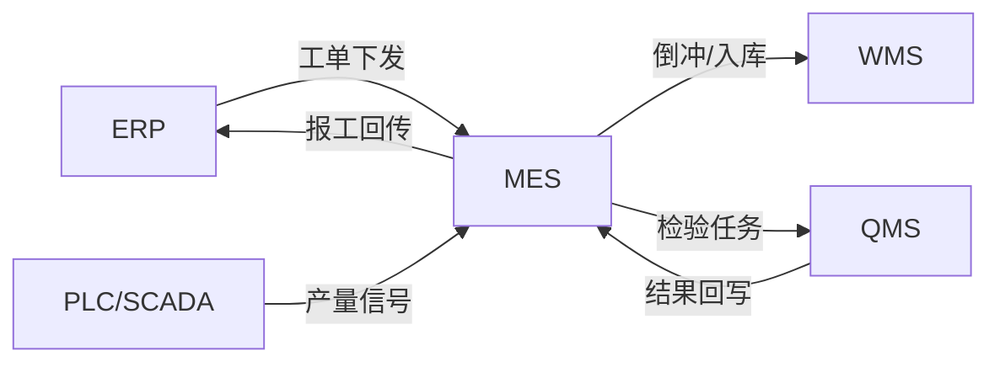
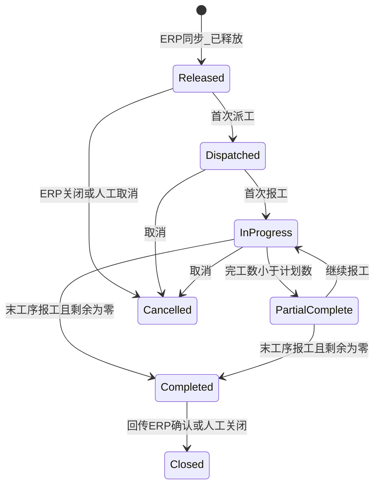
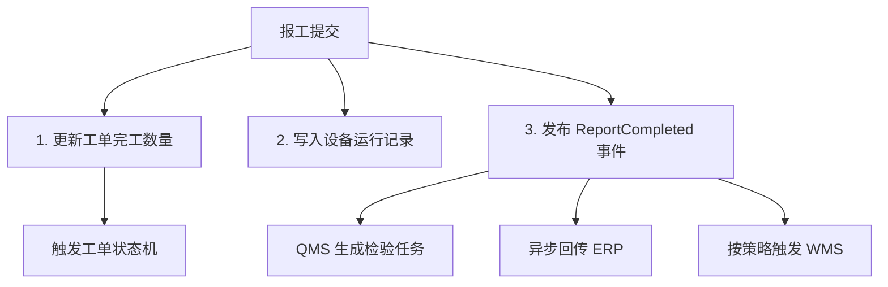
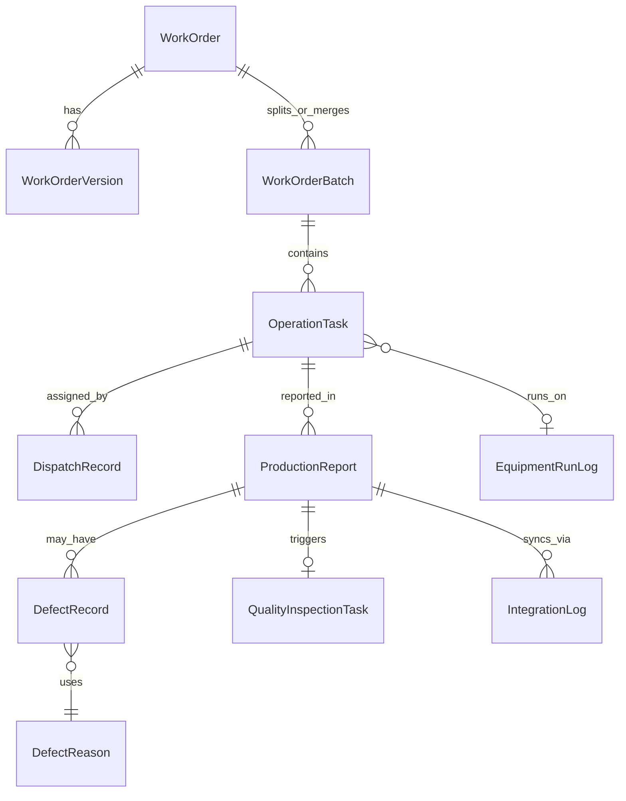

# MES 工单 / 派工 / 报工 设计摘要

> 本文档基于 MES 核心业务逻辑整理，作为后续开发的需求基线与架构参考。  
> 范围：设计摘要与实现路径，不含具体代码与技术栈绑定。

---

## 1. 概述

MES（制造执行系统）在车间层的核心职责，是把 ERP 的生产计划转化为可执行、可追踪、可回传的生产活动。其中三个最关键的业务环节是：

| 环节 | 定位 | 核心问题 |
|------|------|----------|
| **工单** | 生产指令载体 | 做什么、做多少、什么时候要 |
| **派工** | 任务分配 | 谁来做、在哪做 |
| **报工** | 执行反馈 | 做了多少、质量如何、用了多久 |

三者形成闭环：**ERP 下发工单 → MES 派工到人或设备 → 现场报工 → 数据回传 ERP/WMS/QMS**。

### 1.1 与周边系统的关系



- **ERP**：计划源头，负责 MRP、生产订单、成本核算、库存账务
- **WMS**：物料与成品库存，响应倒冲扣料、成品入库
- **QMS**：质量检验，接收检验任务并回写合格/不良数量
- **设备层**：PLC/SCADA 上传产量与运行信号，支撑自动报工

### 1.2 总体可行性结论

| 模块 | 可行性 | 关键前提 |
|------|--------|----------|
| 工单同步与状态映射 | 高 | ERP 接口契约明确、幂等与状态机设计 |
| 工单自动状态流转 | 高 | 工序/报工数据驱动，规则可配置 |
| 工单拆分/合并 | 中高 | 需设计父子关联与数量守恒 |
| 三种派工模式 | 高 | 可共存，按工序类型配置策略 |
| 扫码/终端/自动报工 | 高 | 自动报工依赖设备侧改造 |
| ERP/WMS/QMS 集成 | 中高 | 异步消息 + 重试 + 对账是必选项 |
| 离线报工 | 中 | 需客户端本地队列与冲突合并策略 |

**核心判断**：设计方向正确，符合工业 MES 主流实践。难点不在单点功能，而在**状态一致性、集成可靠性、并发与离线冲突**三类横切问题。

---

## 2. 工单模块

### 2.1 业务定位

工单是生产指令的载体，告诉车间做什么、做多少、什么时候要。在 MES 中，工单通常从 ERP 同步过来：ERP 跑完 MRP 生成生产订单，通过接口推送到 MES。

**第一个设计要点**：工单同步不是简单拷贝，必须处理好**状态映射**。ERP 与 MES 各自维护状态机，两边状态对不上，数据就会乱。

### 2.2 ERP ↔ MES 状态映射

| ERP 状态 | MES 状态 | 说明 |
|----------|----------|------|
| 已释放 | 已下发 | ERP 下达生产指令，MES 接收后可派工 |
| 生产中 | 执行中 / 部分完工 | 可由 MES 报工数据驱动，不必依赖 ERP 推送 |
| 已关闭（正常完工） | 已完工 → 已关闭 | 按关闭原因区分 |
| 已关闭（取消/作废） | 已取消 | 需保留取消原因，禁止继续报工 |

**映射原则**：

- ERP → MES：以上游状态为准，MES 做映射转换，不直接存 ERP 原始枚举
- MES → ERP：报工驱动完工，MES 完工后回传 ERP，由 ERP 确认关闭
- 冲突处理：ERP 推送「已关闭」时，若 MES 仍在执行中，需告警并走人工对账

### 2.3 MES 工单状态机

工单在 MES 中经历以下状态流转，**应设计为自动流转**，减少人工干预：



| MES 状态 | 含义 | 自动流转触发条件 |
|----------|------|------------------|
| 已下发 | 从 ERP 同步，待派工 | ERP 同步「已释放」 |
| 已派工 | 已分配到人/设备/任务池 | 首次派工事件 |
| 执行中 | 至少有一条报工记录 | 首条报工提交 |
| 部分完工 | 有产出但未达计划量 | 累计完工数 < 计划数 |
| 已完工 | 计划量已全部完成 | 最后一道工序报工且 `remaining_qty = 0` |
| 已关闭 | 流程终结 | ERP 确认或人工关闭 |
| 已取消 | 不再执行 | ERP 取消或人工取消 |

**关键规则**：工人报完最后一道工序、剩余数量归零时，系统自动将工单状态扭转为「已完工」，无需人工点击。

### 2.4 工单拆分与合并

**场景**：

- **拆分**：大工单分多天生产 → 拆成多个批次
- **合并**：多个小工单合并集中生产 → 合并为一个执行批次

**数据模型建议**：

```
WorkOrder（ERP 源工单，1:1 对应 ERP 生产订单）
  └── WorkOrderBatch（MES 执行批次，可 1:N 或 N:1）
        └── OperationTask（工序任务）
```

| 操作 | 关联关系 | 数量规则 | 追溯要求 |
|------|----------|----------|----------|
| 拆分 | 1 源工单 → N 批次 | 各批次数量之和 = 源工单数量 | 保留 `parent_erp_order_id` |
| 合并 | N 源工单 → 1 批次 | 合并批次数量 = 各源工单数量之和 | 记录 `source_order_ids[]` |

**回传 ERP 时**：按分摊规则将批次报工数据归集到原 ERP 工单，便于成本核算与追溯。

### 2.5 工单版本管理

**常见坑**：客户频繁改数量、交期、BOM，工单已派工甚至已开工。

**设计对策**：

- 每次变更生成新版本 `WorkOrderVersion`，快照 BOM、数量、交期
- 变更策略可配置：
  - `continue_old`：老版本继续执行，新版本仅影响未派工部分
  - `force_close`：强制关闭老版本，剩余量迁移到新版本
- 变更消息自动推送到相关工位终端，避免工人按旧指令生产

### 2.6 可行性评估

**完全可行**，是 MES 标准能力。实现重点：

1. 同步接口幂等（同一 ERP 工单号重复推送不重复创建）
2. 状态机与报工/派工事件解耦，通过领域事件驱动
3. 拆分/合并时严格校验数量守恒

---

## 3. 派工模块

### 3.1 业务定位

派工是把任务分给具体的工人或设备。无论采用哪种方式，工人都要在终端上看到**当天任务清单**，按优先级排序，完成一项自动刷新。

### 3.2 三种派工模式

三种模式可共存，建议按**工序 / 产线**配置 `dispatch_mode`：

| 模式 | 适用场景 | 实现复杂度 | 关键能力 |
|------|----------|------------|----------|
| **主动派工** | 工序复杂、技能要求高 | 低 | 技能矩阵、负荷看板、审计日志 |
| **抢单** | 工序标准化、技能差异不大 | 中 | 任务池、抢单锁、绩效权重防挑单 |
| **自动派工** | 追求效率、基础数据完善 | 高 | 规则引擎：设备状态 + 技能 + 队列 + 优先级 |

#### 主动派工

- 计划员或班组长在系统中指定工单给人或工位
- 派工时展示：工人技能等级、当前负荷（在制任务数 / 预计工时）
- 适合需要人工判断的复杂场景

#### 抢单模式

- 工单发布到任务池，工人自行抢单
- 需配合绩效权重，防止挑肥拣瘦（如：连续抢单冷却、任务类型轮换）
- 抢单时使用分布式锁，防止同一任务被多人抢到

#### 自动派工

- 系统按规则自动分配，效率最高
- 规则示例：设备空闲 > 技能匹配 > 队列优先级 > 交期紧迫度
- 对基础数据（技能矩阵、设备状态、标准工时）要求高

### 3.3 统一任务模型

三种派工方式底层共用同一任务模型，派工方式只是**分配策略**不同：

```
OperationTask（工序任务）
  ├── work_order_batch_id
  ├── operation_code（工序号）
  ├── planned_qty / completed_qty
  ├── dispatch_mode（主动/抢单/自动）
  ├── assigned_to（工人/工位/设备，可空表示在任务池）
  ├── priority
  └── status（待派工/已派工/执行中/已完成）
```

### 3.4 工人终端

- API：查询当前操作员当日任务，按 `priority + planned_start` 排序
- 完成一项后：WebSocket 推送或短轮询刷新列表
- 展示：工单号、产品型号、工序、计划数量、已完成数量、优先级

### 3.5 派工公平性

**常见坑**：主动派工时班组长容易把好活派给熟人。

**对策**：

- `DispatchAuditLog` 记录：谁在什么时间把哪个工单派给谁
- 支持审计报表，管理层可回溯
- 或改用自动派工，规则透明、可配置、可解释

### 3.6 可行性评估

**完全可行**。建议 MVP 先实现主动派工，Phase 2 再扩展抢单与自动派工。

---

## 4. 报工模块

### 4.1 业务定位

报工是 MES 里最频繁的操作，用户体验最敏感。目标：**十秒内完成一次报工**。

### 4.2 三种报工方式

| 方式 | 输入 | 自动采集 | 依赖 |
|------|------|----------|------|
| **扫码报工** | 扫描工单条码 | 工单号、工序号、产品型号 | 条码规范 |
| **工位终端** | 开始 / 结束按钮 | 工时 | 终端 UI |
| **设备自动报工** | PLC/SCADA 信号 | 产量 + 工时 | 设备改造、消息队列 |

#### 扫码报工（MVP 首选）

1. 工人扫描工单条码
2. 系统自动带出：工单号、工序号、产品型号
3. 工人输入：完工数量、合格数量、不良数量
4. 点确认，全程十秒以内

#### 工位终端集成

- 按「开始」计时，干完按「结束」
- 系统自动记录工时和数量（数量仍可手输或对接计数器）

#### 设备自动报工

- 如注塑机每出一模自动计数上报
- 需设备改造，通过 MQ 接收 PLC/SCADA 信号
- 需处理：信号丢失、重复计数（幂等键）

### 4.3 不良品处理

报工核心难点之一。工人报工时必须区分合格品和不良品，不良品还需细分原因。

**设计规则**：

- 原因**不能**是自由文本，必须从下拉列表选择
- 不同工序、不同产品可配置不同的不良原因列表（`DefectReason` 表）
- 报工记录结构：`good_qty` + `defect_qty` + `defect_reason_id[]`（一种不良可对应多条原因明细）

### 4.4 报工后系统动作（事件驱动）

报工完成后，MES 应自动完成以下三件事：



1. **更新工单完工数量**：剩余为零时自动触发工单「已完工」
2. **更新设备运行记录**：写入 `EquipmentRunLog`（设备、工时、产量）
3. **触发质量检验任务**：按规则自动生成抽检任务推给质检员

最后，报工数据**异步回传 ERP**，用于成本核算和库存扣减。

### 4.5 报工防错

**常见坑**：工人选错工单、填错数量。

**校验规则清单**：

| 规则 | 说明 |
|------|------|
| 数量上限 | 报工数量不能超过工单剩余数量 |
| 工位匹配 | 报工的工单与当前工位 / 产品型号要匹配 |
| 状态校验 | 已完工 / 已取消工单禁止报工，或需二次确认 |
| 并发控制 | 同一工单并发报工使用乐观锁（`version` 字段） |
| 工序顺序 | 可选：前道工序未完成时禁止后道报工 |

### 4.6 离线报工

**常见坑**：车间网络不可能百分之百可靠。

**设计对策**：

- 手持终端支持离线模式，报工数据暂存本地（SQLite / IndexedDB 队列）
- 网络恢复后批量上传
- 服务端冲突检测：按 `(work_order_id, operation_id, timestamp, operator_id)` 识别冲突
- 冲突策略：以服务端为准 + 提供人工对账界面

### 4.7 可行性评估

**完全可行**。MVP 建议先做扫码报工 + 基础防错校验；离线报工和设备自动报工放在 Phase 3。

---

## 5. 周边系统集成

工单、派工、报工与周边系统的集成是 MES 成败关键。

### 5.1 与 ERP 集成

| 方向 | 内容 | 策略 |
|------|------|------|
| ERP → MES | 生产订单 / 工单 | 实时或准实时推送，幂等接收 |
| MES → ERP | 报工数据、完工确认 | 关键工单实时回传，普通工单批量回传 |

**容易出问题的两点**：

1. **接口实时性**：关键工单（急单、高价值）建议实时 MQ 回传；普通工单可定时批量
2. **数据一致性**：报工完成但回传时网络断了 → 必须有重试机制 + 人工对账功能

### 5.2 与 WMS 集成

报工完成后，通常需触发**物料倒冲**或**成品入库**。

- 例：装配线报工完成 → MES 通知 WMS 自动扣减子件库存并生成入库单
- **策略分化**：
  - 低风险产品：报工完立即触发
  - 高风险产品：等 QMS 质检合格后再触发

### 5.3 与设备控制系统集成

自动报工依赖设备上传产量数据。

- MES 接收 PLC / SCADA 的技术信号
- 处理异常：信号丢失、重复计数
- 建议用**消息队列**保证不丢、不重（消费端幂等）

### 5.4 与质量系统集成

- 报工后触发检验任务推给 QMS
- 检验结果回写 MES：若质检发现不良，自动修正报工时的合格数量和不良数量
- 需设计数量修正的审计链，保留修正前后快照

### 5.5 集成基础设施建议

| 组件 | 作用 |
|------|------|
| 集成网关 | 统一对接 ERP/WMS/QMS，协议转换 |
| 消息队列 | RabbitMQ / Kafka，异步解耦 |
| IntegrationLog | 每次同步记录：pending / success / failed / retrying |
| 重试机制 | 指数退避 + 死信队列 |
| 人工对账 | 失败 / 冲突记录的可视化对账界面 |
| 幂等键 | `erp_order_no + report_id` 或 `message_id` |

### 5.6 集成风险汇总

| 系统 | 方向 | 风险点 | 对策 |
|------|------|--------|------|
| ERP | 双向 | 网络断、状态不一致 | 重试 + 对账 |
| WMS | 出 | 过早扣库存 | 按产品风险等级延迟触发 |
| QMS | 双向 | 数量回写冲突 | 修正审计链 + 乐观锁 |
| 设备层 | 入 | 信号丢失/重复 | MQ + 幂等消费 |

---

## 6. 常见坑与对策汇总

| 坑 | 现象 | 对策 |
|----|------|------|
| 工单版本变更 | ERP 改数量/BOM 时现场已开工 | 版本快照 + 变更策略 + 推送工位终端 |
| 派工公平性 | 班组长偏袒派工 | 派工审计日志 / 透明自动派工规则 |
| 报工防错 | 选错工单、超量报工 | 数量/工位/状态校验 + 二次确认 |
| 离线冲突 | 断网期间多人报同一工单 | 本地队列 + 服务端冲突检测 + 对账 |
| 集成断网 | 报工成功但 ERP 未收到 | 异步重试 + IntegrationLog + 人工对账 |
| 状态不同步 | ERP 已关闭 MES 仍在执行 | 状态映射 + 冲突告警 + 人工介入 |

---

## 7. 建议数据模型（概念层）

以下为概念实体，不含 DDL，便于后续选型后落地。



### 核心实体说明

| 实体 | 职责 |
|------|------|
| `WorkOrder` | ERP 源工单，保存 ERP 工单号、产品、计划数量、交期 |
| `WorkOrderVersion` | 工单变更版本快照（BOM、数量、交期） |
| `WorkOrderBatch` | MES 执行批次，支持拆分/合并，关联源 ERP 工单 |
| `OperationTask` | 工序级任务，派工与报工的直接对象 |
| `DispatchRecord` | 派工记录（派给谁、何时、何种模式） |
| `DispatchAuditLog` | 派工操作审计（操作人、时间、对象） |
| `ProductionReport` | 报工记录（数量、工时、操作员） |
| `DefectRecord` | 不良明细（数量、原因） |
| `DefectReason` | 不良原因配置（按工序 + 产品） |
| `QualityInspectionTask` | 报工触发的检验任务 |
| `EquipmentRunLog` | 设备运行记录 |
| `IntegrationLog` | 与 ERP/WMS/QMS 的同步日志 |

---

## 8. 分阶段实施建议

### Phase 1 — MVP（约 4~6 周）

目标：跑通「工单 → 派工 → 报工 → 回传 ERP」主链路。

- [ ] ERP 工单同步（含状态映射）
- [ ] 工单状态自动流转（状态机）
- [ ] 主动派工
- [ ] 扫码报工（含基础防错校验）
- [ ] 报工数据异步回传 ERP（含重试与 IntegrationLog）
- [ ] 工人终端任务清单

### Phase 2 — 扩展能力

- [ ] 抢单 / 自动派工
- [ ] WMS 倒冲 / 成品入库（按产品风险等级）
- [ ] QMS 检验任务联动与结果回写
- [ ] 不良原因按工序 + 产品配置
- [ ] 派工审计报表

### Phase 3 — 高级能力

- [ ] 设备自动报工（PLC/SCADA + MQ）
- [ ] 离线报工与冲突对账
- [ ] 工单拆分 / 合并
- [ ] 工单版本变更管理
- [ ] 工位终端计时报工

---

## 9. 架构原则（跨模块）

1. **事件驱动**：报工、派工、完工等关键动作发布领域事件，集成与状态机订阅事件，避免紧耦合
2. **幂等优先**：所有外部接口（收/发）必须幂等，用业务键去重
3. **最终一致**：MES 与 ERP/WMS 允许短暂不一致，通过对账达到一致
4. **配置优于硬编码**：派工模式、不良原因、WMS 触发时机、状态映射均可配置
5. **审计可追溯**：派工、报工、数量修正、集成同步全链路留痕

---

## 10. 文档说明

- **版本**：v1.0
- **范围**：设计摘要，不含代码实现与具体技术栈选型
- **后续**：技术选型确定后，可在此基础上展开 API 契约、数据库 DDL、状态机实现方案
